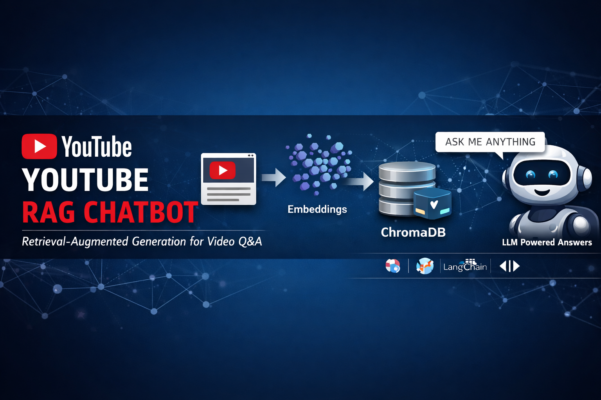

<h1 align="center">YouTube RAG Chatbot</h1>

<p align="center">
A Retrieval-Augmented Generation system for querying YouTube videos
</p>




<p align="center">


</p>

---

## Overview

This project implements a Retrieval-Augmented Generation (RAG) system that allows users to ask questions about any YouTube video. The system extracts the transcript of a video, processes it into meaningful chunks, stores embeddings in a vector database, and retrieves relevant context to generate accurate answers using a language model.

The application is built with a Streamlit interface, enabling users to interact with the system in a simple and intuitive way.

---

## Problem Statement

Understanding long YouTube videos manually is time-consuming. This project solves that problem by enabling users to query video content directly and receive concise, context-aware answers.

---

## Key Features

* Accepts any YouTube video URL
* Extracts transcript using a reliable API
* Splits transcript into semantic chunks
* Stores embeddings in a vector database (ChromaDB)
* Retrieves relevant context using similarity search
* Generates answers using a language model
* Interactive Streamlit-based chat interface
* Displays video identifier for context awareness

---

## System Architecture

The system follows a standard RAG pipeline:

1. Input: YouTube URL
2. Transcript Extraction
3. Text Chunking
4. Embedding Generation
5. Vector Storage (ChromaDB)
6. Query Processing
7. Context Retrieval
8. Answer Generation

---

## Project Structure

```
YT-RAG/
│── app.py
│── main.py
│── requirements.txt
│── config.py
│── src/
│    ├── rag_pipeline.py
│    ├── youtube_loader.py
│    ├── splitter.py
│    ├── embeddings.py
│    ├── vectorstore.py
│    ├── retriever.py
│    ├── llm.py
```

---

## How It Works (Step-by-Step Workflow)

### 1. YouTube Transcript Extraction

The system uses a direct API to extract transcripts:

```python
from youtube_transcript_api import YouTubeTranscriptApi

ytt_api = YouTubeTranscriptApi()
transcript = ytt_api.fetch(video_id)
text = " ".join([t.text for t in transcript])
```

This avoids unreliable dependencies and ensures consistent transcript retrieval.

---

### 2. Text Chunking

The transcript is split into manageable chunks:

```python
splitter = RecursiveCharacterTextSplitter(
    chunk_size=CHUNK_SIZE,
    chunk_overlap=CHUNK_OVERLAP
)
chunks = splitter.split_documents(documents)
```

This ensures efficient embedding and retrieval.

---

### 3. Embedding Generation

Embeddings are generated using Sentence Transformers:

```python
self.model = SentenceTransformer("all-MiniLM-L6-v2", device=self.device)

def embed(self, texts):
    return self.model.encode(texts)
```

These embeddings capture semantic meaning of text chunks.

---

### 4. Vector Database (ChromaDB)

Chunks are stored in a persistent vector database:

```python
db = Chroma.from_documents(
    chunks,
    embedding,
    persist_directory=CHROMA_PATH
)
```

This enables fast similarity-based retrieval.

---

### 5. Retrieval with Ranking

Instead of naive retrieval, the system uses similarity scoring:

```python
docs_with_scores = self.db.similarity_search_with_score(question, k=5)
docs_with_scores = sorted(docs_with_scores, key=lambda x: x[1])
docs = [doc for doc, score in docs_with_scores[:3]]
```

This ensures only the most relevant context is selected.

---

### 6. Context Construction

To avoid model overload, context is limited:

```python
MAX_CONTEXT_CHARS = 2000

for doc in docs:
    if len(context) + len(doc.page_content) < MAX_CONTEXT_CHARS:
        context += doc.page_content
```

This prevents token overflow issues.

---

### 7. Answer Generation

The model generates answers using a controlled prompt:

```python
prompt = f"""
Answer the question clearly using only the context.

Context:
{context}

Question: {question}
"""
```

This ensures grounded and relevant responses.

---

### 8. Streamlit Interface

The UI allows users to interact with the system:

* Enter YouTube URL
* Load video
* Ask questions
* View responses in chat format

---

## Technologies Used

### Core Technologies

* Python

### Machine Learning

* Sentence Transformers (all-MiniLM-L6-v2)
* Transformers (FLAN-T5)

### RAG Components

* LangChain
* ChromaDB

### Data Source

* YouTube Transcript API

### Frontend

* Streamlit

---

## How to Run Locally

### 1. Clone the Repository

```bash
git clone https://github.com/<your-username>/YouTube-RAG-Chatbot.git
cd YouTube-RAG-Chatbot
```

---

### 2. Create Virtual Environment

```bash
python -m venv rag_env
.\rag_env\Scripts\activate
```

---

### 3. Install Dependencies

```bash
pip install -r requirements.txt
```

---

### 4. Run the Application

```bash
streamlit run app.py
```

---

## Usage

1. Enter a YouTube video URL
2. Click "Load Video"
3. Ask questions about the video
4. View generated answers

---

## Limitations

* Depends on availability of YouTube transcripts
* Performance limited by CPU in local environments
* Smaller language model may affect answer quality

---

## Future Improvements

* Add timestamp-based navigation
* Improve retrieval using multi-query techniques
* Upgrade to more powerful language models
* Add chat-style UI enhancements
* Support multiple videos in a single session

---

## Conclusion

This project demonstrates a complete implementation of a Retrieval-Augmented Generation system using real-world data. It highlights key challenges such as context selection, retrieval quality, and prompt design, while providing a functional and interactive application.

---

## License

This project is open-source and available under the MIT License.
